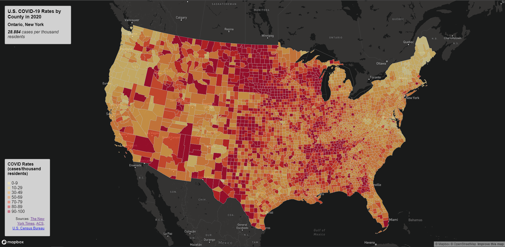
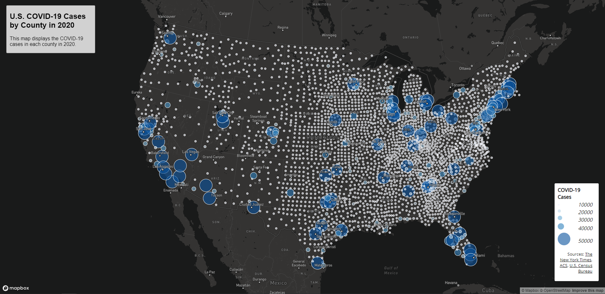

# U.S. COVID-19 rates & cases by county in 2020
## GEOG 458 AA Lab 3
### Anthea Li

This project provides two different maps showing U.S. COVID-19 data: the first is a choropleth map showing the COVID-19 case rates (cases per thousand residents) in the U.S. by county in 2020, and the second is a proportional symbols map of COVID-19 cases by county in 2020.

[U.S. COVID-19 Case Rates](https://anthealigeog.github.io/geog458lab3/map1.html)

[U.S. COVID-19 Cases](https://anthealigeog.github.io/geog458lab3/map2.html)

### Acknowledgement
Mapbox was used to create these maps, and the data sources are [The New York Times](https://github.com/nytimes/covid-19-data/blob/43d32dde2f87bd4dafbb7d23f5d9e878124018b8/live/us-counties.csv), [the 2018 ACS 5 year estimates](https://data.census.gov/cedsci/table?g=0100000US.050000&d=ACS%205-Year%20Estimates%20Data%20Profiles&tid=ACSDP5Y2018.DP05&hidePreview=true), and [the U.S. Census Bureau](https://www.census.gov/geographies/mapping-files/time-series/geo/carto-boundary-file.html).

The data was processed by Steven Bao, and the lab was created by Steven Bao and Prof. Bo Zhao from the Geography department at the University of Washington.